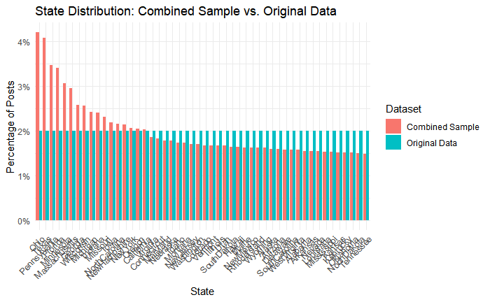
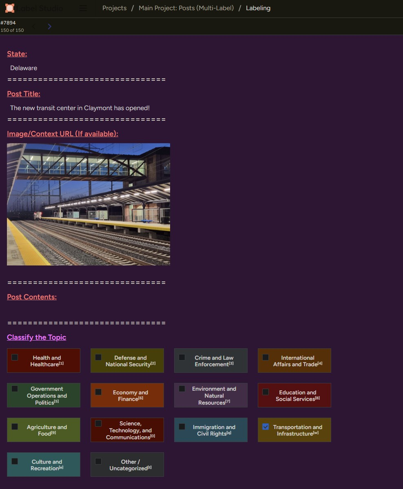

# Social_Media_Final


## Reddit Data Collection

The `Reddit_Data_Scrapers` folder contains scripts designed for efficient and large-scale collection of Reddit posts and comments from state-specific subreddits. These scripts utilize multiple Reddit API keys to manage rate limits and optimize asynchronous data fetching.  They are configured to pull the top 600 threads/posts from the past year for the 50 state subreddits, and all of the comments (including nested comments) from those threads (around 4.5 million comments).  The comments script takes around 16 hours to run, posts is much faster.

---

### Files in the Folder
1. **`redditPostPull.py`**  
   - **Purpose**: Retrieves the top posts from specified state subreddits over the past year.  
   - **Output**: Saves collected posts to a CSV file (`reddit_posts.csv`).

2. **`redditCommentPull.py`**  
   - **Purpose**: Fetches all comments for posts collected by `redditPostPull.py`.  
   - **Output**: Saves comments to a CSV file (`reddit_comments.csv`), grouped by state.
   - (New York had an issue in data collection and has two specific scripts to append to the created dataframes)
---

### Requirements
#### Reddit API Credentials
1. **Create Reddit Accounts**: 
   - Sign up for multiple Reddit accounts to obtain multiple API keys.

2. **Register Applications**: 
   - Log in to each Reddit account and navigate to Reddit Apps.
   - Click "Create App" or "Create Another App".
   - Fill in the application name and select "script" as the type.
   - Set the redirect URI to `http://localhost`.
   - Note down the client ID and client secret (API key).

3. **Organize API Keys**:
   - Create a JSON file named `reddit_api_keys.json` in the `Reddit_Data_Scrapers` folder.
   - Structure the JSON file as follows:
     ```json
     {
       "group1": [
         {
           "client_id": "your_client_id_1",
           "api_key": "your_api_secret_1"
         },
         {
           "client_id": "your_client_id_2",
           "api_key": "your_api_secret_2"
         }
       ],
       "group2": [
         {
           "client_id": "your_client_id_3",
           "api_key": "your_api_secret_3"
         },
         {
           "client_id": "your_client_id_4",
           "api_key": "your_api_secret_4"
         }
       ]
     }
4.  **Environment**:
   - Python 3.8+.
   - Install dependencies via:
     ```bash
     pip install -r requirements.txt
     ```


#### Step 1: Run redditPostPull.py must be run first, as redditCommentsPull.py utilizies the post_ids created
- **Script**: `redditPostPull.py`  
- **Description**:
  - Collects the top posts from state subreddits over the last year.
  - Rotates between multiple API key groups for rate-limited, asynchronous scraping.
- **Output**:
  - Saves posts to `reddit_posts.csv`

## `reddit_posts.csv`

| **Column**       | **Description**                                             |
|-------------------|-------------------------------------------------------------|
| `post_id`        | Unique identifier of the Reddit post                        |
| `state`          | Name of the subreddit (state)                               |
| `title`          | Title of the post                                           |
| `selftext`       | Body text of the post                                       |
| `created_utc`    | UTC timestamp of when the post was created                  |
| `score`          | Score (upvotes - downvotes) of the post                     |
| `url`            | URL of the post                                             |
| `num_comments`   | Number of comments on the post                              |
| `author`         | Username of the post's author                               |

---

## Step 2: Run 
- **Script**: `redditCommentPull.py`  
- **Description**:
  - Collects all the comments from the top posts produced by redditPostPull.py
  - Rotates between multiple API key groups for rate-limited, asynchronous scraping.
- **Output**:
  - Saves comments to `reddit_comments.csv`
    
## `reddit_comments.csv`  

| **Column**       | **Description**                                             |
|-------------------|-------------------------------------------------------------|
| `post_id`        | Identifier of the post to which the comment belongs         |
| `state`          | Name of the subreddit (state)                               |
| `comment_id`     | Unique identifier of the comment                            |
| `body`           | Text content of the comment                                 |
| `created_utc`    | UTC timestamp of when the comment was created               |
| `score`          | Score of the comment                                        |
| `author`         | Username of the comment's author                            |


## Image Handling and Sampling for Label Studio
To prepare to for manual labeling of the social media data, several preprocessing steps need to be completed, namely image handling and sampling.  In our dataset, 35% of reddit posts 
contained images, many of which were crucial for determining context.  To addresss this, the script `reddit_post_image_handling.py` uses reddit_posts.csv urls to search for image 
extensions and retrieves images from Reddit post URLs and saves them locally.  Warning: This will easily be over 20GB of data, and the script will take several hours to run.  We moved these to the cloud for hosting, but if you're working local that's fine too.

### Image Download Script

`reddit_post_image_handling.py`

**Key Features:**
- **Normalization of URLs**: The script cleans and normalizes the URLs to address inconsistencies such as backslashes or whitespace.
- **Filtering Valid Image Links**: Only URLs pointing to supported image formats (`.jpg`, `.png`, `.gif`, etc.) are retained.
- **Concurrent Downloading**: Uses `asyncio` and `aiohttp` to download multiple images simultaneously, significantly reducing runtime.
- **Retry Logic with Exponential Backoff**: Handles rate limits and transient errors by retrying failed downloads with increasing delays.

**Output**:  
Images are saved in the directory `post_images/`, with filenames corresponding to their respective `post_id` (e.g., `abc123.jpg`).

---

### Data Sampling for Label Studio
Once the images have been downloaded, you can proceed to using `labelStudioSampleCreation.rmd`, which handles Label Studio preprocessing as well as generates a stratified,
proportional, and constrained sample with prioritization based on engagement metrics within each State.  It also performs lemmatization on a dummy column to facilitate a keyword search for each policy topic of interest, to further drive representative sampling for all classes into the manual phase.  


#### Sampling Methodology

1. **Policy Area Classification**  
   Each post is classified into one of several predefined policy areas using a keyword-based matching approach.  
   - **Text Preprocessing**: Titles and body text are lemmatized for better keyword matching using the `textstem` R library.  
   - **Keyword Matching**: Policy areas are defined by a set of keywords, such as:
     - *Health*: `health`, `medicine`, `hospital`, `insurance`, etc.
     - *Environment*: `climate`, `pollution`, `wildlife`, etc.  
     Posts without a match are classified as *Other / Uncategorized*.

2. **State-Specific Sampling**  
   The sampling ensures a balanced representation across U.S. states while prioritizing relevance:
   - **Minimum and Maximum Constraints**: Each state contributes at least 90 posts but no more than 350.
   - **Weighting by Engagement**: Sampling is limited-weight proportional to the total comments per state.
   - **Stratification by Policy Area**: Posts are distributed across policy areas to maintain diversity in content.

3. **Post Selection Criteria**  
   Posts are prioritized based on engagement:
   - **80th Percentile Thresholds**: Posts in the top 20% for each State by `num_comments` or `score` are prioritized for selection.
   - **Random Sampling for Remaining Posts**: To fill gaps, additional posts are randomly sampled within states, excluding duplicates.

4. **"Other / Uncategorized" Posts**  
   An additional 1,000 posts classified as "Other / Uncategorized" are included in the final dataset to ensure representation of general or miscellaneous topics.

#### Final Dataset Characteristics

- **Total Sample Size**: 6,000 posts, plus 1,000 *Other / Uncategorized* posts.
- **Balanced Distribution**: Ensures proportional representation of states and policy areas while maintaining diversity.
- **Output File**: The final dataset is saved as `final_sample.csv`.

---

#### Visualization and Quality Assurance

To verify the dataset's representativeness:
- **State Distribution**: The number of posts per state is visualized in a bar chart.
- **Policy Area Distribution**: Policy areas are similarly analyzed to confirm proportional representation.
- **Comparison to Original Data**: Distributions of the final sample are compared to the original dataset to highlight differences and ensure sampling goals are met.

---

**Visualization Examples**:  
Graphs comparing the distribution of states and policy areas in the sampled dataset are included to validate the sampling process.  

  

---

### How to Run the Sampling Process

1. **Prepare the Input Data**  
   Ensure `reddit_posts.csv` and `reddit_comments.csv` are available in the working directory.

2. **Run Image Download**  
   Use `download_images.py` to fetch images linked in posts. Save them in `post_images/`.

3. **Execute the Sampling Script**  
   Run `labelStudioSampleCreation.Rmd` to generate the balanced ready to label dataset
   - Output: `final_sample.csv`
  
#### `final_sample.csv`

| **Column**       | **Description**                                             |
|-------------------|-------------------------------------------------------------|
| `post_id`        | Unique identifier of the Reddit post                        |
| `state`          | Name of the subreddit (state)                               |
| `title`          | Title of the post                                           |
| `selftext`       | Body text of the post                                       |
| `policy_area`    | Classified policy area of the post                          |
| `num_comments`   | Number of comments on the post                              |
| `score`          | Score (upvotes - downvotes) of the post                     |
| `image_url`      | URL of the image associated with the post                   |


## Labeling Process with Label Studio

To prepare the dataset for analysis, we used **[Label Studio](https://labelstud.io/)** for labeling Reddit posts. This process involved both **single-label** and **multi-label classification** tasks.  We set ours up on a virtual machine on Google Cloud, and uploaded the reddit images downloaded from the previous script to a bucket on the Cloud.  Those images were then efficently fed into the Label Studio setup so that our annotators could have full context while labeling.  


Ours can be seen here: http://34.23.190.214:8080/projects/

<div style="text-align: center;">
  
</div>  


### Overview of the Labeling Process

1. **Team Collaboration**:
   - We recruited additional annotators and provided training to ensure consistent and high-quality annotations.
   - We provided a setup guide, training, and reference guide for all labelers (Including members of our team), which were displayed everytime someone entered a project
   - Reference guide provided in-depth category definitions and explainations to keep labeling between annotators consistent.
        - [Starting Guide PDF](pdfs/Labeling_Getting_Started.pdf)
        - [Reference Guide PDF](pdfs/LAbeling_Reference_Guide.pdf)
   - Label Studio Info: [Label Studio Documentation](https://labelstud.io/guide/)
   
2. **Task Types**:
   - **Multi-Label Classification**: 2,500 posts were labeled with one or more categories, allowing for posts to belong to multiple policy areas or topics.
   - **Single-Label Classification**: 1,000 posts were labeled with exactly one category, simplifying the classification process.

---

### Label Studio Setup

1. **Data Preparation**:
   - The sampled dataset (`final_sample.csv`) was uploaded to Label Studio.
   - Each record included:
     - **State**: State subreddit the post was made in
     - **Post Title**: Title of the Post
     - **Image URL**: (if applicable): Visual content automatically displayed with posts from Google Cloud bucket
     - **Post Contents**: Text the author posted along with the title, if any


3. **Label Studio Interface**:
   - Each labeler was assigned tasks directly in Label Studio.
   - The interface included:
      - Large color annotation buttons for each category, to assist in speed and comfortability of annotators
      - Automated queue on Submit or Skip
      - Full random delivery to keep things interesting for annotators and ensure distribution of class balance

4. **Quality Assurance**:
   - An initial training phase allowed labelers to familiarize themselves with the task.
   - Randomly selected posts were reviewed to ensure labeling consistency.
   - Individual annotator results for Cohen's Kappa statistics

---

### Outputs

- **Labeled Dataset**:
  - After completion, the labeled data was exported from Label Studio in .CSV format.
  - The final dataset was processed into CSV format for further analysis.

- **Label Summary**:
  - A summary of labeled categories, including frequency and distribution, was generated for exploratory analysis.
  - Save this file as Classification_Model/data/raw/labeled_reddit_posts_raw.csv
  - Bring in an additional copy of reddit_posts.csv and place into Classification_Model/data/raw/reddit_posts_raw.csv

---


## Classification Model Preprocessing

The **classification model preprocessing pipeline** is implemented in Python to prepare Reddit post and comment data for classification tasks. This includes handling both labeled and unlabeled datasets, ensuring they are cleaned, normalized, and formatted for multi-label and single-label classification.  Only Posts will be covered here due to the large file size and computing requirements for handling the 4.5 million comments.

---

### Overview of Preprocessing Pipeline

The preprocessing process is orchestrated by the script `Classification_Model/main_preprocessing.py`, which utilizes helper modules to automate and modularize tasks.

#### Key Features:
1. **Labeled Data Preprocessing**:
   - Parses multi-label topics from raw data fields from Label Studio Export.
   - Cleans and combines text fields (title + body text).
   - Converts multi-label topics into a **binary label matrix** for machine learning.
   - Assigns a **primary label** to each post for single-label classification using a prioritization strategy (Note: No Single-Label models were moved to production).
   - Outputs a processed dataset for labeled posts (`Classification_Model/data/processed/labeled_reddit_posts_processed.csv`).

2. **Unlabeled Data Preprocessing**:
   - Filters out posts already labeled to avoid duplication.
   - Cleans and combines text fields (title + body text).
   - Initializes placeholders for topic and label fields.
   - Outputs a processed dataset for unlabeled posts (`Classification_Model/data/processed/unlabeled_reddit_posts_processed.csv`).

3. **Topic Distribution Analysis**:
   - Computes and prints the distribution of primary labels.
   - Counts the occurrences of all topics across the dataset (multi-label).
   - Outputs summary statistics to a CSV (`Classification_Model/data/processed/total_topic_occurrences.csv`).

---

### Script Breakdown

#### **`main_preprocessing.py`**  
The entry point for the preprocessing pipeline:
- Calls labeled and unlabeled data preprocessing functions.
- Outputs processed datasets and summary statistics.

#### **`utils.py`**  
Utility functions used throughout the pipeline:
- **`clean_text()`**: Cleans text by removing URLs, special characters, and unnecessary spaces, and converts it to lowercase.
- **`assign_single_label()`**: Assigns a single primary label to a post, prioritizing non-governmental labels if multiple are present.
- **`normalize_topics()`**: Ensures consistent formatting for topic labels.

#### **`preprocess_labeled.py`**  
Handles preprocessing for the labeled dataset:
- Parses and normalizes multi-label topics.
- Converts topics to a binary matrix using `MultiLabelBinarizer`.
- Cleans text fields and combines title and body.
- Assigns a primary label to each post for single-label classification.

#### **`preprocess_unlabeled.py`**  
Handles preprocessing for the unlabeled dataset:
- Filters out posts already present in the labeled dataset.
- Cleans text fields and combines title and body.
- Initializes empty labels for future annotation.

---

### Outputs

1. **Processed Labeled Dataset (`labeled_reddit_posts_processed.csv`)**:
   - Includes cleaned text fields, binary topic labels, and primary labels.

2. **Processed Unlabeled Dataset (`unlabeled_reddit_posts_processed.csv`)**:
   - Includes cleaned text fields and placeholders for future labeling.

3. **Summary Statistics**:
   - **Total Topic Occurrences (`total_topic_occurrences.csv`)**:
     - Provides the count of each topic across all posts.
   - **Primary Label Distribution**:
     - Displays the count of posts per primary label (printed to console).

---

### Topics and Labels

The classification task uses the following predefined topics:
- **National Security and International Affairs** (combined from "Defense" and "International Affairs")
- **Government Operations and Politics**
- **Health and Healthcare**
- **Crime and Law Enforcement**
- **Education and Social Services**
- **Economy and Finance**
- **Science, Technology, and Communications**
- **Immigration and Civil Rights**
- **Agriculture and Food**
- **Environment and Natural Resources**
- **Culture and Recreation**
- **Transportation and Infrastructure**
- **Other / Uncategorized**

---

### How to Run the Preprocessing Pipeline

1. **Prepare the Raw Data**:
   - Place the raw labeled and unlabeled datasets in the `data/raw/` directory:
     - `labeled_reddit_posts_raw.csv`
     - `reddit_posts_raw.csv`

2. **Run the Main Preprocessing Script**:
   ```bash
   python main_preprocessing.py


## Policy Area Categories

---

### 🔴 Health and Healthcare 🔴
**Description:**  
Topics related to health, healthcare services, public health initiatives, and medical research.

**Example:**  
*"Another public hospital closes in Montana, the third this year."*

---

### 🟠 Defense and National Security 🟠
**Description:**  
Covers armed forces, national defense, homeland security, and military policies.


**Example:**  
*"I’m worried that China may come and steal my goats in the night, is that possible? Do they like goats?"*

---

### 🔵 Crime and Law Enforcement 🔵
**Description:**  
Includes crime prevention, law enforcement, policing, and emergency management.
 

**Example:**  
*"Third officer arrested in New York this week on corruption charges."*

---

### 🌍 International Affairs and Trade 🌍
**Description:**  
Focuses on international relations, foreign trade, diplomacy, and international finance.


**Example:**  
*"Vermont tightens border regulations with Canada, will maple syrup prices go up?"*

---

### 🟢 Government Operations and Politics 🟢
**Description:**  
Topics on government operations, legislation, law, political processes, and congressional matters.


**Example:**  
*"State congress motions for unlimited snack budget."*

---

### 🟠 Economy and Finance 🟠
**Description:**  
Encompasses topics related to financial stability, economic growth, labor policies, and trade practices that impact citizens’ day-to-day lives and the overall economy.


**Example:**  
*"If our property taxes go up again this year, I’m moving to the moon. I mean it this time, Elon is really making progress on the moon."*

---

### 🌱 Environment and Natural Resources 🌱
**Description:**  
Covers environmental protection, natural resources, energy, and water resource management.


**Example:**  
*"Historic flood washes away brand new solar panel installations."*

---

### 📚 Education and Social Services 📚
**Description:**  
Covers education, social welfare, housing, family support, and social sciences.


**Example:**  
*"Affordable housing is impossible to find right now in our state!"*

---

### 🌾 Agriculture and Food 🌾
**Description:**  
Includes agriculture, farming policies, food production, and food safety.


**Example:**  
*"Organic farming takes a big hit this year, due to the wow-crop-delicious insect boom."*

---

### 🔬 Science, Technology, and Communications 🔬
**Description:**  
Topics on scientific research, technological advancements, and communication systems.


**Example:**  
*"Comcast sues small family-owned telephone maker in Florida."*

---

### 🛂 Immigration and Civil Rights 🛂
**Description:**  
Focuses on immigration policies, civil rights, minority issues, and Native American matters.


**Example:**  
*"This is crazy, my son can’t even get a job at Fast Food Express due to the recent influx of Swedish Meatball Farmers from Portugal."*

---

### 🚧 Transportation and Infrastructure 🚧
**Description:**  
Covers transportation systems, public works, and infrastructure development.
 

**Example:**  
*"I swear to god if they don’t fix these potholes I’m going to write another strongly written letter."*

---

### 🎭 Culture and Recreation 🎭
**Description:**  
Includes arts, culture, religion, sports, recreational activities, and animal-related topics.

**Example:**  
*"I love these moose. I’m so glad we can own 5 now legally."*

---

### ❓ Other / Uncategorized ❓
**Description:**  
Use this label if the content does not fit into any specific category or is uncategorized.

**Example:**  
*"The post discusses personal opinions on various unrelated topics without a clear topic focus."*
